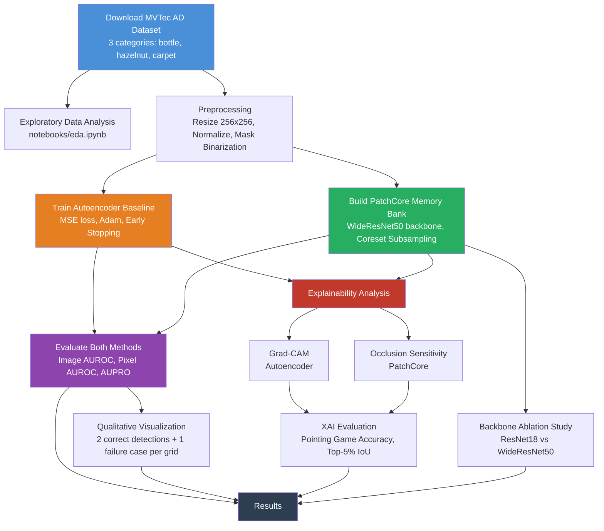

# Industrial Surface Defect Detection - MVTec AD

## Team

| Name | Registration | Email |
|------|-------------|-------|
| M.T. Dineth | E/23/076 | [e23076@eng.pdn.ac.lk](mailto:e23076@eng.pdn.ac.lk) |
| H.M.U.A. Perera | E/23/266 | [e23266@eng.pdn.ac.lk](mailto:e23266@eng.pdn.ac.lk) |
| A.W.K.D.A. Alagiyawanna | E/23/012 | [e23012@eng.pdn.ac.lk](mailto:e23012@eng.pdn.ac.lk) |

**Course:** CO543/CO5430 Computer Vision - 2026
**Group:** G08 | **Project ID:** P17 | **Category:** Industrial Inspection

## Problem Statement

Unsupervised anomaly detection for industrial surface inspection, where the goal is
to identify defective products using only defect-free training images. This project
compares two approaches on the MVTec Anomaly Detection dataset: (1) a convolutional
autoencoder baseline trained from scratch that detects anomalies via reconstruction
error and (2) PatchCore, a state-of-the-art method using pretrained ImageNet
features (transfer learning) with a memory bank of normal patch embeddings. We
evaluate on three categories: bottle and hazelnut (objects) and carpet (texture),
covering both object-level and texture-level defect detection scenarios. On top of
detection, the project adds an **explainable AI (XAI)** layer: a gradient-based
attribution method per model (Grad-CAM for the autoencoder, occlusion sensitivity
for PatchCore) that is quantitatively evaluated (not just visualized) against the
ground-truth defect masks, so the pipeline reports not only *whether* an image is
anomalous but *why* and how trustworthy that explanation is.

## Pipeline Overview



## Setup

### Prerequisites

- Python 3.10 to 3.12 (recommended for anomalib compatibility)
- CUDA-capable GPU recommended (CPU-only works but is slower)

### Installation

```bash
# Create virtual environment
python -m venv .venv

# Activate (Windows)
.venv\Scripts\activate
# Activate (Linux/Mac)
# source .venv/bin/activate

# Install dependencies
pip install -r requirements.txt
```

## Reproduction Steps

Run all commands from the project root directory.

```bash
# 1. Download the MVTec AD dataset (3 categories: bottle, hazelnut, carpet)
python scripts/download_data.py

# 2. Train the autoencoder baseline (all 3 categories)
python scripts/train_baseline.py

# 3. Train PatchCore with WideResNet50 backbone (all 3 categories)
python scripts/train_patchcore.py

# 4. Evaluate both methods -> results/metrics.csv
python scripts/evaluate.py

# 5. Generate qualitative outputs -> results/qualitative/
python scripts/make_qualitative.py

# 6. Run backbone ablation study -> results/ablation.csv
python scripts/ablation_backbone.py

# 7. Explainability analysis (Grad-CAM / occlusion sensitivity) -> results/explainability.csv
python scripts/explain.py
```

### Single-Category Quick Test
To verify the pipeline on just one category (faster):
```bash
python scripts/train_baseline.py --categories bottle --epochs 50
python scripts/train_patchcore.py --categories bottle
python scripts/evaluate.py --categories bottle
```

## Expected Runtime

| Step | GPU (consumer) | CPU-only |
|------|---------------|----------|
| Download data | 5-15 min | 5-15 min |
| Train autoencoder (3 cats) | 15-30 min | 30-60 min |
| Train PatchCore WRN50 (3 cats) | 5-10 min | 15-30 min |
| Evaluate all | 5-10 min | 10-20 min |
| Qualitative outputs | 2-5 min | 5-10 min |
| Ablation (both backbones) | 10-20 min | 30-60 min |
| Explainability analysis | 5-10 min | 30-60 min |
| **Total** | **~50-100 min** | **~2.5-4 hours** |

**Hardware assumptions:** Single NVIDIA GPU with >=4 GB VRAM (e.g., GTX 1650 or better).
All steps work on CPU. Pass `--device cpu` to scripts if no GPU is available.
WideResNet50 requires more memory than ResNet18; if GPU memory is limited, use
`--backbone resnet18` for PatchCore.

## Results

### Method Comparison (metrics.csv)

| Method | Category | Image AUROC | Pixel AUROC | PRO |
|--------|----------|-------------|-------------|-----|
| Autoencoder | bottle | 0.8849 | 0.7247 | 0.4291 |
| Autoencoder | hazelnut | 0.9664 | 0.9400 | 0.8995 |
| Autoencoder | carpet | 0.3190 | 0.5471 | 0.2271 |
| PatchCore (WRN50) | bottle | 1.0000 | 0.9856 | 0.9445 |
| PatchCore (WRN50) | hazelnut | 1.0000 | 0.9882 | 0.9523 |
| PatchCore (WRN50) | carpet | 0.9864 | 0.9908 | 0.9494 |

PatchCore beats the autoencoder baseline on every category and every metric,
consistent with the literature. The gap is largest on **carpet**, where the
autoencoder's image AUROC (0.319) is worse than random guessing. Reconstruction
error is a poor anomaly signal for a texture category where "normal" already
contains high-frequency, irregular-looking variation.

### Ablation: Backbone Comparison (ablation.csv)

| Category | Backbone | Image AUROC | Pixel AUROC | PRO | Avg Inference (ms) |
|----------|----------|-------------|-------------|-----|---------------------|
| bottle | ResNet18 | 1.0000 | 0.9785 | 0.9237 | 159.0 |
| bottle | WideResNet50 | 1.0000 | 0.9856 | 0.9445 | 213.8 |
| hazelnut | ResNet18 | 0.9989 | 0.9891 | 0.9458 | 285.8 |
| hazelnut | WideResNet50 | 1.0000 | 0.9882 | 0.9523 | 350.6 |
| carpet | ResNet18 | 0.9795 | 0.9878 | 0.9333 | 293.1 |
| carpet | WideResNet50 | 0.9864 | 0.9908 | 0.9494 | 344.5 |

WideResNet50 edges out ResNet18 on almost every metric, but the margin is
small (<=1.3 points of AUROC/PRO on every category) while inference time is
25-35% higher. ResNet18 is the better choice under tight latency/memory
budgets; WideResNet50 is worth it only when the extra localization quality
(PRO) matters more than throughput.

### Qualitative Results

Grid images showing Original / Ground Truth Mask / Predicted Anomaly Heatmap
are saved in `results/qualitative/`. Each grid contains 2 correct detections
and 1 failure case per (method, category) combination.

### Explainability (explainability.csv)

Two gradient/perturbation-based attribution methods explain *why* each model
flagged an image as anomalous. Grad-CAM is used for the autoencoder (direct
access to its architecture) and occlusion sensitivity for PatchCore (its
anomaly score is only reachable through forward passes; see
[Explainability Method](#explainability-method) below for why). Each is scored
against the ground-truth defect mask using two standard XAI metrics, computed
over the same 20 anomalous test images per category for both methods:

- **Pointing Game accuracy**: does the single highest-attribution pixel fall inside the true defect region?
- **Top-5% IoU**: overlap between the highest-attribution 5% of pixels and the true defect region.

| Method | Category | Pointing Game Acc | Top-5% IoU |
|--------|----------|--------------------|------------|
| Autoencoder (Grad-CAM) | bottle | 0.45 | 0.165 |
| Autoencoder (Grad-CAM) | hazelnut | 0.55 | 0.186 |
| Autoencoder (Grad-CAM) | carpet | 0.00 | 0.017 |
| PatchCore (Occlusion) | bottle | 0.60 | 0.117 |
| PatchCore (Occlusion) | hazelnut | 0.35 | 0.077 |
| PatchCore (Occlusion) | carpet | 0.50 | 0.039 |

Neither method localizes as tightly as the detection AUROC numbers might
suggest. Both operate at a coarser spatial resolution than the raw anomaly
map (16x16 for Grad-CAM's bottleneck features, 16x16 occlusion patches for
PatchCore), so top-5% IoU is modest everywhere. The more informative pattern
is where each explanation *fails*: autoencoder Grad-CAM scores 0.0 pointing-game
accuracy on carpet, mirroring its near-random detection AUROC there. When the
detector itself is not finding the defect, its explanation has nothing correct
to point at. PatchCore's explanation quality does not track its (uniformly
excellent) detection AUROC as closely, because occlusion sensitivity is
explaining the anomaly *map* rather than the same signal used for detection
and is more exposed to the border artifacts discussed below.

## Explainability Method

The autoencoder and PatchCore are explained with two *different* attribution
techniques, chosen per architecture rather than applying one method
uniformly, because they have different constraints:

- **Autoencoder: Grad-CAM** (Selvaraju et al., 2017). We have direct access
  to the encoder as a plain `nn.Module`, so we hook its final feature map and
  backpropagate the image-level anomaly score to get a gradient-weighted
  localization map. Global-average-pooling the gradient (the textbook
  Grad-CAM recipe) turned out to destroy localization here. Our anomaly
  score is already spatially selective (built from a top-k over per-pixel
  errors), so pooling away the spatial gradient pattern left only a
  location-agnostic "which channels matter" signal that lit up generic
  high-contrast image content instead of the actual defect. We keep the
  gradient at full spatial resolution (gradient x activation, summed over
  channels) instead, which localizes correctly (see `src/explainability.py`).
- **PatchCore: occlusion sensitivity** (Zeiler & Fergus, 2014), not
  Grad-CAM. anomalib wraps PatchCore's backbone feature extraction in
  `torch.no_grad()` internally, so gradients from the anomaly score never
  reach the input pixels. This holds regardless of which entry point is
  used to call the model. Occlusion sensitivity needs only forward passes,
  sidestepping that constraint entirely: it slides a patch of the image's own
  mean pixel value (not black, because a fixed extreme value is itself
  out-of-distribution for a memory bank of real texture patches and would
  bias the attribution) over the input and measures how much each occlusion
  reduces the anomaly map's total response.

Both attribution maps are scored against the ground-truth defect mask with
Pointing Game accuracy and top-5% IoU (see `src/metrics.py`).

## Project Structure

```
├── data/                    # Dataset (gitignored, populated by download_data.py)
├── docs/                    # GitHub Pages project page (Jekyll)
├── scripts/
│   ├── download_data.py     # Downloads MVTec AD (3 categories)
│   ├── train_baseline.py    # Trains convolutional autoencoder per category
│   ├── train_patchcore.py   # Builds PatchCore memory bank per category
│   ├── evaluate.py          # Computes all metrics, writes metrics.csv
│   ├── make_qualitative.py  # Generates qualitative grid images
│   ├── ablation_backbone.py # ResNet18 vs WideResNet50 comparison
│   └── explain.py           # Grad-CAM / occlusion explainability analysis
├── src/
│   ├── autoencoder.py       # Convolutional autoencoder model (~2.5M params)
│   ├── datasets.py          # MVTec AD dataset loader and utilities
│   ├── metrics.py           # Image AUROC, Pixel AUROC, AUPRO, Pointing Game, top-k IoU
│   ├── explainability.py    # Grad-CAM, occlusion sensitivity, XAI metrics
│   ├── anomalib_compat.py   # Compatibility fix for an anomalib/pandas version bug
│   └── results_io.py        # Merges per-category results into shared CSVs
├── notebooks/
│   └── eda.ipynb            # Exploratory data analysis
├── results/                 # Generated outputs (checkpoints/ gitignored, rest tracked)
│   ├── metrics.csv          # Main results table
│   ├── ablation.csv         # Backbone comparison results
│   ├── explainability.csv   # Explanation quality metrics
│   ├── qualitative/         # Detection grid visualizations
│   ├── explainability/      # Explanation grid visualizations
│   └── checkpoints/         # Trained model weights (gitignored)
├── requirements.txt
├── .gitignore
└── README.md
```

## Dataset

**MVTec Anomaly Detection (MVTec AD)**

> Bergmann, P., Fauser, M., Sattlegger, D., & Steger, C. (2021).
> The MVTec Anomaly Detection Dataset: A Comprehensive Real-World Dataset
> for Unsupervised Anomaly Detection. *International Journal of Computer
> Vision*, 129, 1038-1059. https://doi.org/10.1007/s11263-020-01400-4

**License:** CC BY-NC-SA 4.0 (Creative Commons Attribution-NonCommercial-ShareAlike 4.0).
This dataset is for **non-commercial use only**.

**Download:** https://www.mvtec.com/company/research/datasets/mvtec-ad

## References

- Roth, K., Pemula, L., Zepeda, J., Scholkopf, B., Brox, T., & Gehler, P.
  (2022). Towards Total Recall in Industrial Anomaly Detection. *CVPR*.
  (PatchCore; used via [anomalib](https://github.com/open-edge-platform/anomalib))
- Selvaraju, R. R., Cogswell, M., Das, A., Vedantam, R., Parikh, D., &
  Batra, D. (2017). Grad-CAM: Visual Explanations from Deep Networks via
  Gradient-based Localization. *ICCV*.
- Zeiler, M. D., & Fergus, R. (2014). Visualizing and Understanding
  Convolutional Networks. *ECCV*. (Occlusion sensitivity)
- Zhang, J., Bargal, S. A., Lin, Z., Brandt, J., Shen, X., & Sclaroff, S.
  (2018). Top-Down Neural Attention by Excitation Backprop. *IJCV*.
  (Pointing Game evaluation protocol)

## Known Limitations

- **The autoencoder baseline fails on texture categories.** Carpet image
  AUROC (0.319) is worse than random guessing. Reconstruction error does not
  distinguish defects from normal texture variation when "normal" is already
  irregular-looking. PatchCore does not have this problem (0.986 on carpet).
- **PatchCore shows border artifacts.** While building the occlusion-based
  explanations, we found PatchCore's anomaly map sometimes has an elevated
  response at image borders strong enough to compete with the true defect
  region for the map's single global maximum. Occlusion attribution had to
  target the anomaly map's *sum* rather than its max for exactly this reason
  (see `scripts/explain.py`). This is a real failure mode worth flagging for
  deployment, not just an artifact of our explanation method.
- **Neither explanation method localizes as tightly as detection AUROC would
  suggest.** Both operate at a coarser spatial resolution than the raw
  anomaly map (see Explainability results above), so top-5% IoU is modest
  across the board. Autoencoder Grad-CAM's complete failure on carpet
  (0.0 Pointing Game accuracy) tracks its detection failure there. An
  explanation cannot correctly point at a defect the model is not finding.
- The autoencoder's localization quality is further limited by its small
  receptive field and the inherent blurriness of reconstruction-based
  approaches.

## AI Tool Use Disclosure

This project used AI coding assistance (Claude) for boilerplate and debugging;
all code was reviewed and understood by the group. See commit history for details.

## Links

- [Project Repository](https://github.com/cepdnaclk/e23-co543-DefectVision-Intelligent-Surface-Defect-Detection-Using-Deep-Learning)
- [Project Page](https://cepdnaclk.github.io/e23-co543-DefectVision-Intelligent-Surface-Defect-Detection-Using-Deep-Learning/)
- [Department of Computer Engineering](http://www.ce.pdn.ac.lk/)
- [University of Peradeniya](https://eng.pdn.ac.lk/)
