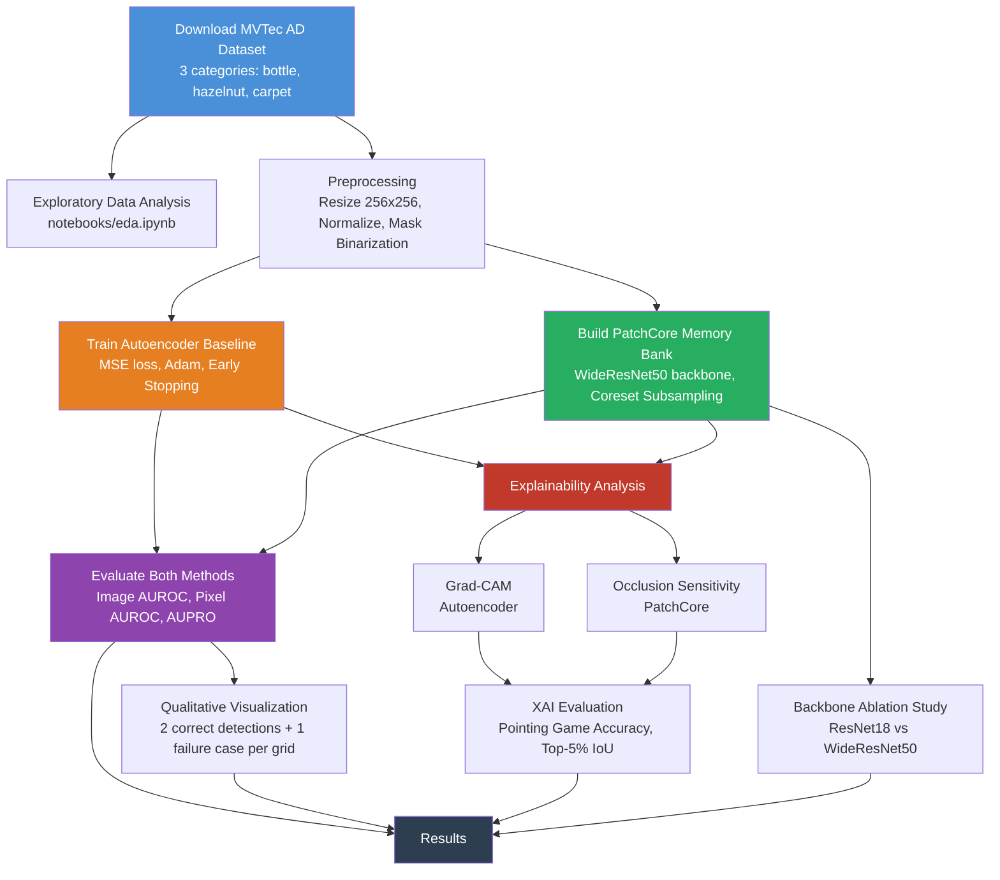

# Automated Industrial Surface Defect Detection and Localization Using Deep Anomaly Detection

**CO543/CO5430 Computer Vision Project - 2026**
**Group G08 | Project P17 | Category: Industrial Inspection**

---

## Team

- E/23/076, M.T. Dineth, [e23076@eng.pdn.ac.lk](mailto:e23076@eng.pdn.ac.lk)
- E/23/266, H.M.U.A. Perera, [e23266@eng.pdn.ac.lk](mailto:e23266@eng.pdn.ac.lk)
- E/23/012, A.W.K.D.A. Alagiyawanna, [e23012@eng.pdn.ac.lk](mailto:e23012@eng.pdn.ac.lk)

## Table of Contents

1. [Introduction](#introduction)
2. [Problem Statement](#problem-statement)
3. [Pipeline](#pipeline)
4. [Methods](#methods)
5. [Explainability](#explainability)
6. [Results](#results)
7. [Technologies Used](#technologies-used)
8. [Links](#links)

---

## Introduction

Surface defect detection is a critical quality control task in manufacturing. Manual inspection is slow, subjective and error-prone under high-throughput conditions. Automated detection using computer vision can reduce waste, lower costs and improve consistency. However, defective samples are rare in practice, making supervised classification impractical because there are not enough labeled examples of every possible defect type.

This project explores **unsupervised anomaly detection**, where models are trained exclusively on defect-free images and learn to flag anything that deviates from normality at test time. We compare a reconstruction-based baseline with a state-of-the-art feature-embedding method and add a quantitative explainability layer so the system reports not only *whether* an image is anomalous but *why*.

## Problem Statement

Given a set of defect-free training images from an industrial product category, the goal is to:

1. **Detect** whether a test image contains a defect (image-level binary classification)
2. **Localize** the defect at pixel level (produce an anomaly heatmap)
3. **Explain** why the model flagged the image, with quantitative evaluation of explanation quality

We evaluate on three categories from the MVTec Anomaly Detection (MVTec AD) dataset: **Bottle** (rigid object), **Hazelnut** (organic object) and **Carpet** (texture), covering structurally different defect scenarios.

## Pipeline

The project follows a seven-stage pipeline:

**Stage 1 - Data Download:** Downloads MVTec AD for three categories via direct URL with anomalib fallback.

**Stage 2 - Baseline Training:** Trains a Convolutional Autoencoder per category on defect-free images using MSE loss, Adam optimizer, ReduceLROnPlateau scheduler and early stopping (patience=10).

**Stage 3 - PatchCore Training:** Builds PatchCore memory banks using a pretrained WideResNet50 backbone. Features from layers 2 and 3 are collected and reduced via coreset subsampling (ratio=0.1). No gradient-based training is needed.

**Stage 4 - Evaluation:** Computes Image AUROC, Pixel AUROC and AUPRO for both methods on all categories.

**Stage 5 - Qualitative Visualization:** Generates grid images showing Original / Ground Truth Mask / Anomaly Heatmap for 2 correct detections and 1 failure case per (method, category) pair.

**Stage 6 - Backbone Ablation:** Compares ResNet18 vs. WideResNet50 as PatchCore backbones, measuring accuracy and inference time.

**Stage 7 - Explainability:** Applies Grad-CAM (autoencoder) and occlusion sensitivity (PatchCore) to 20 anomalous samples per category, evaluated with Pointing Game accuracy and Top-5% IoU.

## Methods

### Convolutional Autoencoder (Baseline)

A symmetric encoder-decoder network (~2.5M parameters) trained to reconstruct defect-free images. The encoder uses four strided Conv2d blocks (with BatchNorm and ReLU) to compress 256x256x3 input to a 16x16x256 bottleneck. The decoder mirrors this with four ConvTranspose2d blocks and a final Sigmoid activation. Anomalies produce higher reconstruction error (pixel-wise MSE) because the model has never seen defects during training. The image-level score uses a top-k mean (k=100) of pixel errors for robustness.

### PatchCore (Improved Method)

PatchCore (Roth et al., 2022) uses a pretrained WideResNet50 backbone to extract patch-level features from intermediate layers. All patch features from normal training images form a memory bank, reduced to 10% via coreset subsampling. At test time, each patch is scored by its nearest-neighbour distance to the bank. No fine-tuning is required on the target domain, leveraging transfer learning from ImageNet.

## Explainability

Each method is explained with a different attribution technique, chosen based on architectural constraints:

**Autoencoder: Modified Grad-CAM.** We hook the encoder's final feature map and backpropagate the anomaly score. Standard Grad-CAM's global average pooling destroys spatial information here (the anomaly score is already spatially selective), so we keep the gradient at full spatial resolution: element-wise gradient x activation, summed over channels, followed by ReLU and bilinear upsampling.

**PatchCore: Occlusion Sensitivity.** anomalib wraps PatchCore's feature extraction in `torch.no_grad()`, so gradients are unavailable. Occlusion sensitivity slides a patch filled with the image's channel-wise mean over the input and measures the drop in anomaly response. The mean fill avoids out-of-distribution artifacts that would occur with black or white patches.

Both methods are scored against ground truth masks using Pointing Game accuracy (does the peak attribution fall inside the defect?) and Top-5% IoU (overlap of the hottest 5% of attribution pixels with the defect).

## Results

### Detection and Localization

| Method | Category | Image AUROC | Pixel AUROC | PRO |
|--------|----------|-------------|-------------|-----|
| Autoencoder | bottle | 0.8849 | 0.7247 | 0.4291 |
| Autoencoder | hazelnut | 0.9664 | 0.9400 | 0.8995 |
| Autoencoder | carpet | 0.3190 | 0.5471 | 0.2271 |
| PatchCore (WRN50) | bottle | 1.0000 | 0.9856 | 0.9445 |
| PatchCore (WRN50) | hazelnut | 1.0000 | 0.9882 | 0.9523 |
| PatchCore (WRN50) | carpet | 0.9864 | 0.9908 | 0.9494 |

PatchCore achieves near-perfect scores on all categories. The autoencoder fails on carpet (Image AUROC 0.319, worse than random) because reconstruction error cannot distinguish defects from normal texture variation.

### Backbone Ablation

| Category | Backbone | Image AUROC | Pixel AUROC | PRO | Avg Inference (ms) |
|----------|----------|-------------|-------------|-----|---------------------|
| bottle | ResNet18 | 1.0000 | 0.9785 | 0.9237 | 159.0 |
| bottle | WideResNet50 | 1.0000 | 0.9856 | 0.9445 | 213.8 |
| hazelnut | ResNet18 | 0.9989 | 0.9891 | 0.9458 | 285.8 |
| hazelnut | WideResNet50 | 1.0000 | 0.9882 | 0.9523 | 350.6 |
| carpet | ResNet18 | 0.9795 | 0.9878 | 0.9333 | 293.1 |
| carpet | WideResNet50 | 0.9864 | 0.9908 | 0.9494 | 344.5 |

WideResNet50 provides marginal accuracy gains (<=1.3 points) at 25-35% higher inference cost. ResNet18 is preferable under latency constraints.

### Explainability

| Method | Category | Pointing Game Acc | Top-5% IoU |
|--------|----------|--------------------|------------|
| Autoencoder (Grad-CAM) | bottle | 0.45 | 0.165 |
| Autoencoder (Grad-CAM) | hazelnut | 0.55 | 0.186 |
| Autoencoder (Grad-CAM) | carpet | 0.00 | 0.017 |
| PatchCore (Occlusion) | bottle | 0.60 | 0.117 |
| PatchCore (Occlusion) | hazelnut | 0.35 | 0.077 |
| PatchCore (Occlusion) | carpet | 0.50 | 0.039 |

Both methods operate at 16x16 spatial resolution, limiting tight localization. The autoencoder's 0.0 Pointing Game on carpet mirrors its detection failure: an explanation cannot point at a defect the model is not finding.

## Technologies Used

- **PyTorch** - deep learning framework for autoencoder implementation
- **anomalib** - PatchCore implementation with pretrained backbone support
- **scikit-learn** - AUROC computation
- **matplotlib** - visualization and qualitative grid generation
- **OpenCV** - image processing utilities
- **NumPy/SciPy** - numerical computation and connected component analysis
- **MVTec AD Dataset** - benchmark dataset (CC BY-NC-SA 4.0)

## References

- Bergmann, P., Fauser, M., Sattlegger, D., & Steger, C. (2021). The MVTec Anomaly Detection Dataset. *IJCV*, 129, 1038-1059.
- Roth, K., Pemula, L., Zepeda, J., Scholkopf, B., Brox, T., & Gehler, P. (2022). Towards Total Recall in Industrial Anomaly Detection. *CVPR*.
- Selvaraju, R. R., et al. (2017). Grad-CAM: Visual Explanations from Deep Networks. *ICCV*.
- Zeiler, M. D., & Fergus, R. (2014). Visualizing and Understanding Convolutional Networks. *ECCV*.
- Zhang, J., et al. (2018). Top-Down Neural Attention by Excitation Backprop. *IJCV*.

## Links

- [Project Repository](https://github.com/cepdnaclk/e23-co543-DefectVision-Intelligent-Surface-Defect-Detection-Using-Deep-Learning){:target="_blank"}
- [Project Page](https://cepdnaclk.github.io/e23-co543-DefectVision-Intelligent-Surface-Defect-Detection-Using-Deep-Learning/){:target="_blank"}
- [Department of Computer Engineering](http://www.ce.pdn.ac.lk/)
- [University of Peradeniya](https://eng.pdn.ac.lk/)
